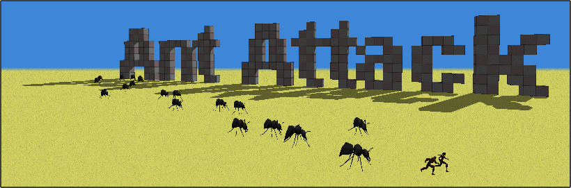
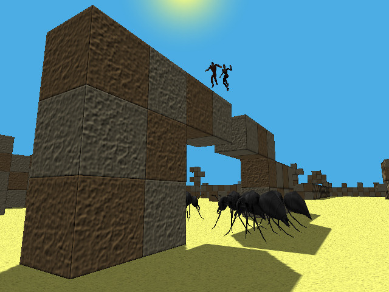
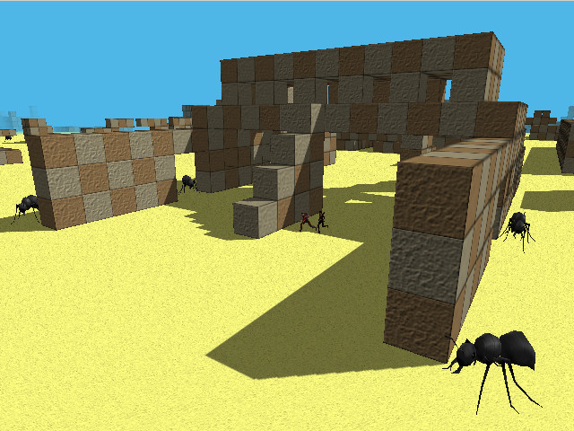
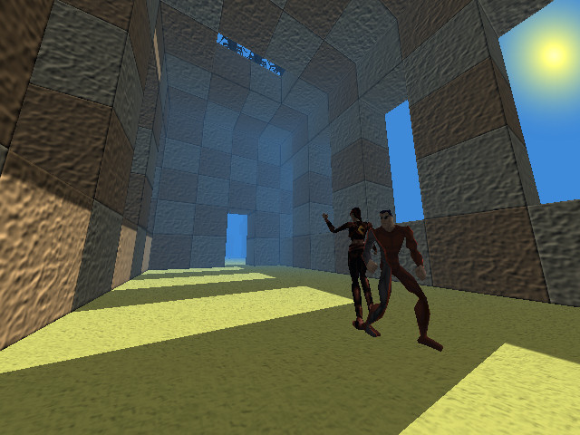
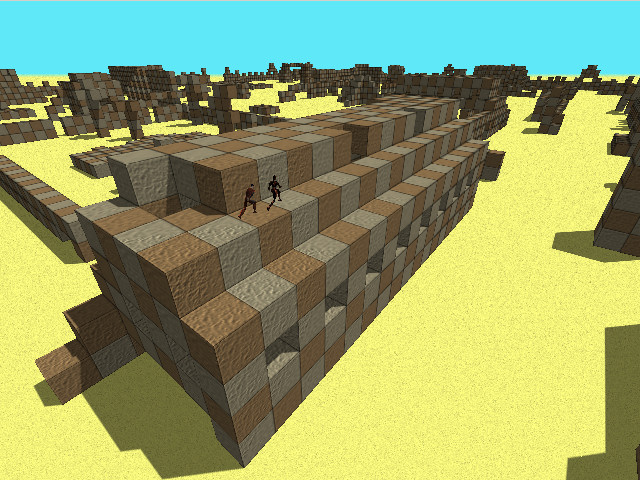
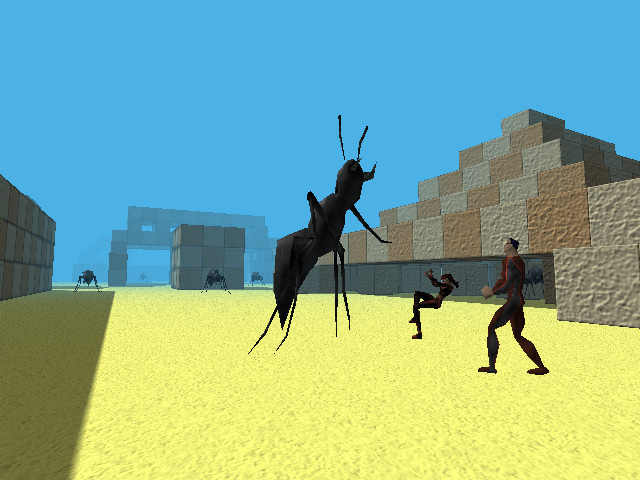
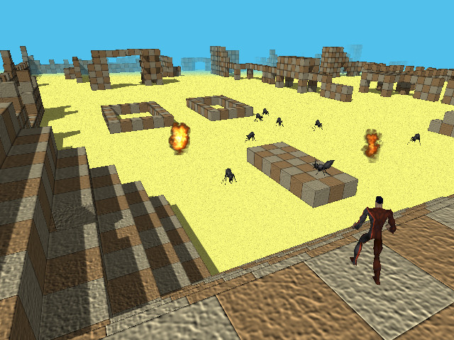

# Introduction
Ant Attack is a complete freeware Windows remake of the [original ZX Spectrum game](http://sandywhite.co.uk/fun/ants/), programmed by Sandy White and released in 1983.

It is accompanied by a fully-featured Map Editor that can be used to customise the existing game, or to create entirely new games from scratch. Also included is the map of Sandy White's second "soft-solid" game, Zombie Zombie, which now teems with insects instead of the undead.

Ant Attack should run on any 32-bit or 64-bit version of Windows. The main pre-requisite is that OpenGL v1.2 is present, which is often installed with your graphics drivers.

# Installation
The latest Windows installation can be downloaded from the [releases page](https://github.com/steven-knock/ant-attack/releases/latest).

# Compiling
Ant Attack was developed with [Borland Delphi 6](http://delphi.wikia.com/wiki/Delphi_6). The [build.cmd](build.cmd) file will compile and place the executables in a 'bin' directory, assuming that the Delphi 6 compilers (dcc32.exe and brcc32.exe) are on the Windows path.

# Screenshots #

## Oxymine ##

## Skaz Yandor ##

## The Ancient ##

## The Anti Chamber ##

## The Pyramid ##

## The Squarena ##

